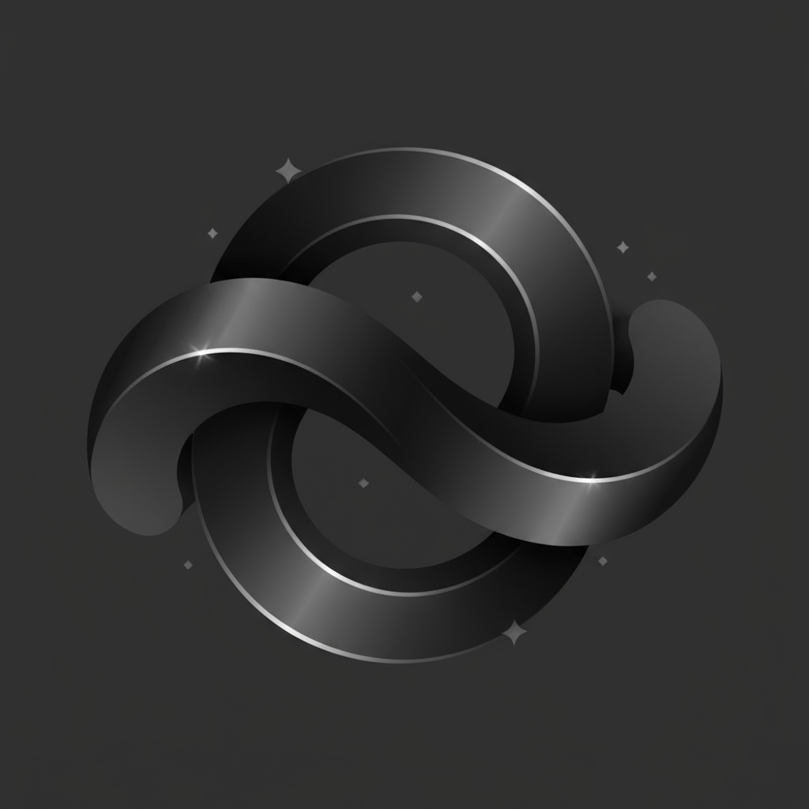

# AI Data Engineering Brasil

<div align="center">
  
  <p><strong>The Premier Brazilian Community for AI & Data Engineering</strong></p>

  [](https://aide-brasil.ai)
  [](https://reactjs.org/)
  [](https://vitejs.dev/)
</div>

---

## Quick Start

```bash
npm install --legacy-peer-deps
cp .env.example .env.local
npm run dev
```

---

## Project Structure

```
aide-brasil-website/
├── .claude/              # Claude Code agents (AI-assisted development)
│   └── agents/           # Specialized agents for webinars, components, etc.
├── briefings/            # Business documents & PDFs
├── public/               # Static assets (images, favicon, manifest)
├── scripts/              # Setup utilities (npm run setup)
└── src/
    ├── components/
    │   ├── shared/       # Reusable components (Header, WebhookForm, etc.)
    │   └── ui/           # shadcn/ui components (20+ primitives)
    ├── config/           # Webhook configuration
    ├── features/         # Feature-based architecture
    │   ├── webinars/     # Webinar pages (5 active)
    │   ├── bootcamps/    # Bootcamp pages
    │   └── academy/      # Academy landing
    ├── hooks/            # Custom hooks (useWebhook, useGTMTracking)
    ├── lib/              # Utilities & GTM integration
    ├── pages/            # Main pages (HomePage)
    ├── styles/           # CSS files (mobile, desktop, performance)
    └── utils/            # Performance & validation utilities
```

---

## Key Features

| Feature | Description |
|---------|-------------|
| **Webinars** | 5 landing pages with registration forms |
| **Bootcamps** | AI Data Engineer bootcamp with video sections |
| **Lead Capture** | n8n webhooks with UTM tracking |
| **Analytics** | GTM dual-container (web + server) |
| **Performance** | Code splitting, lazy loading, service worker |

---

## Tech Stack

**Core:** React 19, Vite 6, React Router 7, Tailwind CSS 4
**UI:** shadcn/ui, Radix UI, Framer Motion, Lucide Icons
**Forms:** React Hook Form, Zod validation
**Analytics:** GTM, Web Vitals

---

## Routes

| Route | Page |
|-------|------|
| `/` | Home |
| `/webinars` | Webinar catalog |
| `/webinars/dominando-*` | Individual webinars |
| `/bootcamp/ai-data-engineer` | Bootcamp |
| `/academy` | Academy |

---

## Scripts

| Command | Description |
|---------|-------------|
| `npm run dev` | Start dev server |
| `npm run build` | Production build |
| `npm run preview` | Preview build |
| `npm run setup` | Environment setup wizard |

---

## Environment Variables

See `.env.example` for all options. Key variables:

```bash
VITE_GTM_WEB_ID=GTM-XXXXXXX        # GTM container
VITE_N8N_WEBHOOK_URL=https://...   # Lead capture webhook
VITE_N8N_ENABLED=true              # Enable webhooks
```

---

## Deployment

Auto-deploys to Vercel on push to `main`.

```bash
vercel --prod
```

---

## AI-Assisted Development

This project uses Claude Code agents (`.claude/agents/`) for:
- Webinar page generation
- Component building
- Code review
- Performance optimization

Agents read live code patterns - no static documentation drift.

---

## License

MIT - [AI Data Engineering Brasil](https://aide-brasil.ai)
